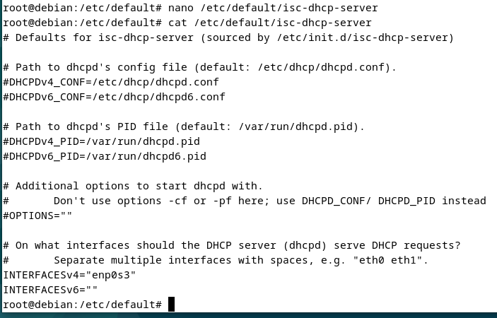
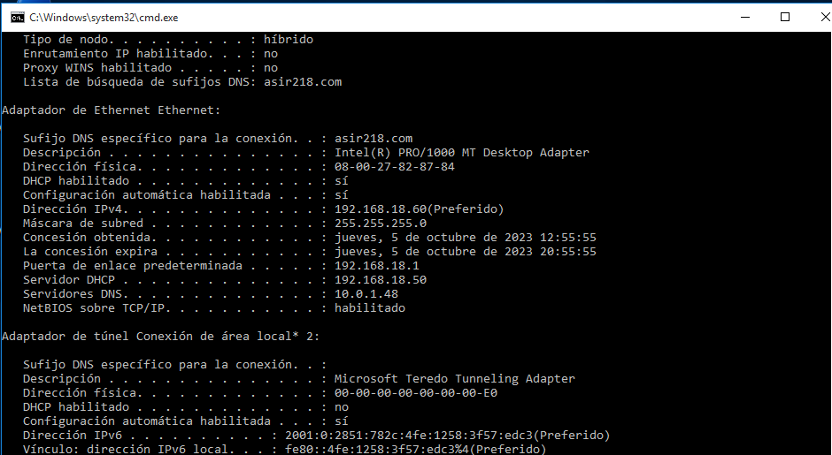
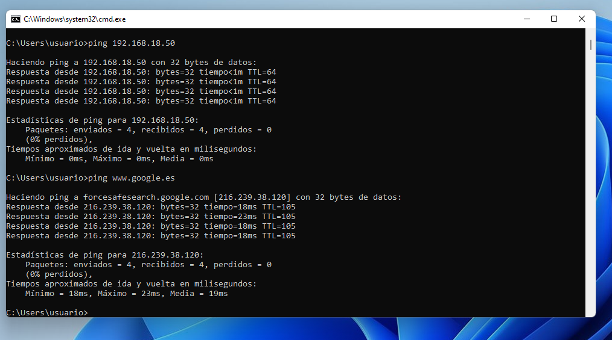

# Práctica 2: Instalación y configuración de servidor y cliente DHCP en Debian.
## Índice
[1. Introducción](#introducción)  
[2. Recursos ](#recursos)  
[3. Configuración de la tarjeta red](#configuración-de-la-tarjeta-red)  
[4. Cambiar a Superusuario](#cambiar-a-superusuario)  
[5. Istalación del paquete](#instalación-del-paquete)  
[6. Configuración](#configuración)  
[7. Configuración del servicio dhcp](#configuración-del-servicio-dhcp)  
[8. Comprobación dhcp](#comprobación-dhcp)  
[9. Comprobación en el cliente con reserva](#comprobación-en-el-cliente-con-reserva)  
[10. Comprobación en el cliente sin reserva](#comprobación-en-el-cliente-sin-reserva)  
[11. IPs](#ips)  
    

## Introducción
Esta actividad consiste en realizar un tutorial en el que se describan los ficheros involucrados y los comandos necesarios para configurar el servidor isc-dhcp-server en Debian.

## Recursos
o	PC con acceso a Internet y paquete ofimático instalado.  
o	VirtualBox  
o	Debian  
o	Windows cliente  
o	pfSense  
o	https://github.com/  
o	Visual Studio Code 

## Configuración de la tarjeta red

### Enunciado

El primer paso va a ser con figurar una IP estatica en un Debian 12 mediante la interfaz grafica

### Práctica

  
Una vez configurado en la interfaz grafica abriremos un terminal y ejecutaremos el comando "__ip a__" para comprobar que se halla confiigurado correctamente

## Cambiar a Superusuario

### Enunciado

Se va ha cambiar a el superusuario para poder instalar el servicio debido a que no podremos instalar ni configurar sin ser root, utilizaremos el comando __su -__

### Práctica

## Instalación del paquete

### Enunciado

En este apartado vamos ha instalar el paquete dhcp

### Práctica

## Configuración

### Enunciado

Configuración de la interfaz por la que va ha escuchar

### Práctica

## Configuración del servicio dhcp

### Enunciado

A continuación, vamos ha modificar el archivo dhcpd.conf para configurar el servicio dhcp

### Práctica

   
Realizamos una copia del archivo dhcpd.conf  
___
  
Configuramos las opciones del dhcp
___
  
Configuración de la reserva de ip

## Comprobación dhcp

### Enunciado

Comprobación del estado del servidor dhcp

### Práctica

 

## Comprobación en el cliente con reserva

### Enunciado

Comprobación en el cliente con reserva

### Práctica

 

## Comprobación en el cliente sin reserva

### Enunciado

Comprobación en el cliente sin reserva

### Práctica

## IPs

### Router PfSense :  
192.168.18.1/24
### Servidor DHCP Debian :  
192.168.18.50/24
### Cliente con Reserva :  
192.168.18.60
### Cliente sin Reserva :
DHCP

